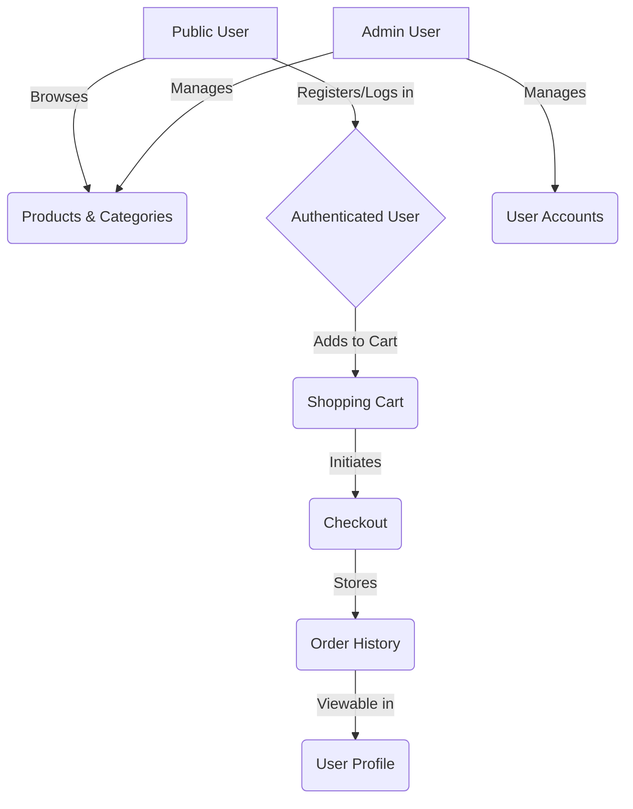

# 🛒 EasyShop E-Commerce Platform

[](https://spring.io/projects/spring-boot)
[](https://www.oracle.com/java/)
[](https://www.mysql.com/)
[](https://jwt.io/)
[](https://maven.apache.org/)

---

##  Introduction

**EasyShop** is a robust, full-stack e-commerce solution designed to provide a seamless shopping experience for users and a powerful management interface for administrators. Built with a modern **Spring Boot** backend, it leverages **JWT-based security** and a **MySQL** database to ensure data integrity, scalability, and security.


> This project follows the DAO (Data Access Object) pattern, ensuring a clean separation between business logic and data persistence.

---

##  Key Features

- **Secure Authentication**: Multi-role authentication (User/Admin) using JWT tokens.
- **Category Management**: Browse products by categories or manage them as an admin.
- **Product Discovery**: Advanced search and filtering capabilities for products.
- **Dynamic Shopping Cart**: Real-time cart updates and persistent storage.
- **Checkout & Orders**: Streamlined checkout process with order history tracking.
- **User Profiles**: Personalized user data management and preferences.

---

## Visuals & Screenshots

Frontend flow:


<div align="center">
  <h3>[Feature Name]</h3>
  
</div>

---

##  Highlights

- **Modern Architecture**: Cleanly separated layers (Controllers, DAOs, Models, Security).
- **RESTful API**: Standardized endpoints for seamless frontend integration.
- **Robust Security**: Protected routes and role-based access control.
- **Data Persistence**: Reliable MySQL integration with high-performance DAO implementations.

---

##  Project Structure

```text
src
└── main
    ├── java
    │   └── org.yearup
    │       ├── EasyShopApplication.java       # Main entry point
    │       ├── configurations                 # Spring configuration classes
    │       ├── controllers                    # REST API Endpoints
    │       │   ├── AuthenticationController   # Login & Registration
    │       │   ├── CategoriesController       # Category Management
    │       │   ├── OrdersController           # Order History & Processing
    │       │   ├── ProductsController         # Product Catalog
    │       │   ├── ProfileController          # User Account Management
    │       │   └── ShoppingCartController     # Cart Logic
    │       ├── data                           # Data Access Layer
    │       │   ├── mysql                      # JDBC Implementations
    │       │   └── *Dao.java                  # DAO Interfaces
    │       ├── models                         # Entity & DTO Classes
    │       └── security                       # JWT & Security Logic
    └── resources
        ├── application.properties             # App configuration
        └── database                           # SQL scripts for DB setup
```

---

##  Getting Started

### 1. Prerequisites
- **Java 17** or higher
- **Maven 3.x**
- **MySQL 8.0**

### 2. Database Setup
1. Open your MySQL Workbench or CLI.
2. Run the script found in `database/create_database_easyshop.sql` to initialize the database schema and sample data.

### 3. Configuration
Update `src/main/resources/application.properties` with your database credentials:
```properties
datasource.url=jdbc:mysql://localhost:3306/easyshop
datasource.username=YOUR_USERNAME
datasource.password=YOUR_PASSWORD
```

### 4. Running the Backend
```bash
./mvnw spring-boot:run
```
The API will be available at `http://localhost:8080`.

---

##  Frontend Integration

To connect your frontend application:
1. Ensure the backend is running.
2. Set your base API URL to `http://localhost:8080`.
3. Handle JWT tokens by storing them in `localStorage` or `sessionStorage` after a successful login.
4. Include the token in the `Authorization` header for protected routes:  
   `Authorization: Bearer <your_token>`

---

##  UI Flow & Interaction



---

##  Future Enhancements (v2.0)

- [ ] **Payment Integration**: Stripe or PayPal integration for real payments.
- [ ] **Search Optimization**: Implementation of Elasticsearch for faster product discovery.
- [ ] **Admin Dashboard**: A dedicated UI for managing sales and inventory analytics.
- [ ] **Email Notifications**: Automated order confirmation and delivery updates.
- [ ] **Mobile App**: Cross-platform mobile version using React Native.

---

##  License

This project is licensed under the **MIT License**.

---